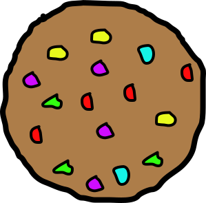
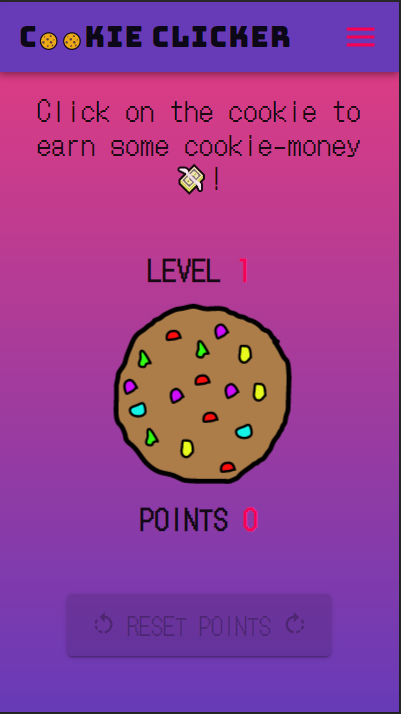
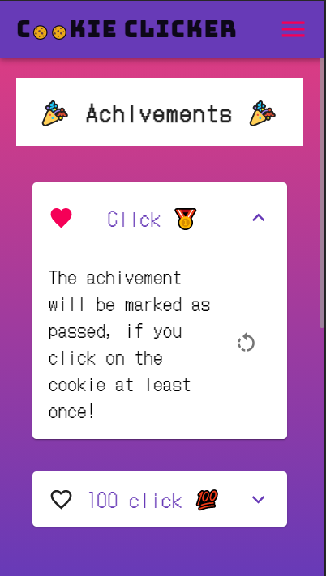
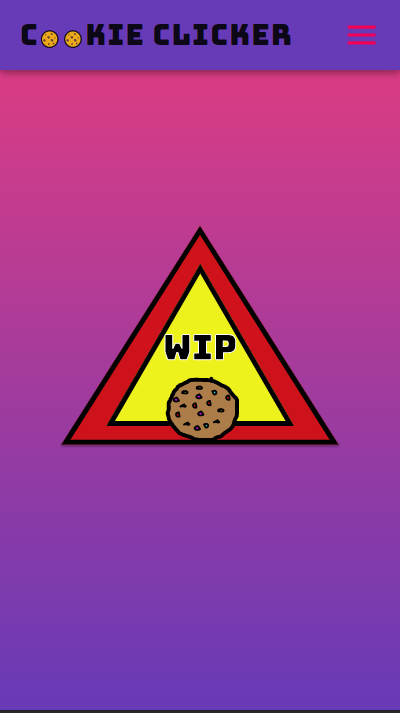
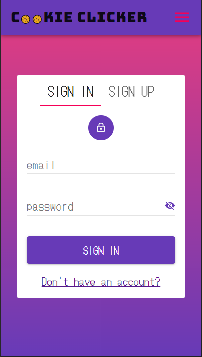

<h1>Authentication application </h1>

<h2>👀 Shots 👀</h2> 

    
    
    
    

<i>Above screenshots comes from <strong>mobile</strong> view of app<i>

<h2>🧻 Descriptions 🧻</h2>

Cookie clicker - an application whose aim is to click on a cookie to gain points and experience level. Based on the earned points the user unlocks further badges/achivements. The user also has the option to purchase machines that will automate the cookie clicker and track its progress (**not implemented yet**) 

Project inspired by http://orteil.dashnet.org/cookieclicker/ 😇.

> <h3>🦾 Functionalities 🦾</h3>
> 
> - **signup/sigin**
> 
>   - authentication is based on server side cookies and jwt
>   - TODO:
>       - password reset mechanism
>       - oAuth2 implementation (for authentication purposes)
>       - ?account activation mechanism?
> - **coockie clicker**
>   
>   - points, levels and achivements functionalities 
>   - TODO:
>       - shop functionalities (e.g. ability to puchase machines)
>
> - **TODO: multilang application**
> 
> - **responsive design** (mobile first)
> 

<h2>🧰 Key Tools/Librares 🧰</h2>

- **client**
  - **libraries**: 
    -  React (functional components, hooks)
    -  redux, react-redux
    -  react-query
    -  react-hook-form
  -  **UI**: MaterialUI
  - **styling**: styled components
  
- **server**:
  - Express with TypeScript
  - **Database**: MongoDB (mongoose)
  - **Logger**: morgan
  - **Dev Server**: nodemon
  
- **development**: Docker, docker-compose, prettier

<h2>🏃‍♂️ How to deal with 🏃‍♂️</h2>

- make sure all curcial env variables has been provided 
- `docker-compose -f docker-compose.dev.yaml up --build`

